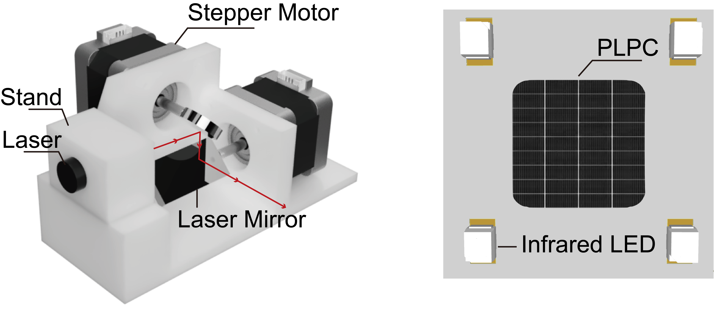

# Receiver-Localization-and-Beam-Steering

This project is the implementation of our proposed scheme of receiver localization and beam steering. With the 3D printing models and the source code, you can replicate the findings in our paper.




This project includes:
- source code (in python) that implements the functionalities and the experimental protocols
- 3D-printing models (STL files) for the mechanical design
- PCB design for the receiver
- experimental results in video form
- bill of materials

## Project structure
```
├── mix3d
│   ├── main_instance_segmentation.py <- the main file
│   ├── conf                          <- hydra configuration files
│   ├── datasets
│   │   ├── preprocessing             <- folder with preprocessing scripts
│   │   ├── semseg.py                 <- indoor dataset
│   │   └── utils.py        
│   ├── models                        <- Mask3D modules
│   ├── trainer
│   │   ├── __init__.py
│   │   └── trainer.py                <- train loop
│   └── utils
├── data
│   ├── processed                     <- folder for preprocessed datasets
│   └── raw                           <- folder for raw datasets
├── scripts                           <- train scripts
├── docs
├── README.md
└── saved                             <- folder that stores models and logs
```

## Data preparation
To prepare training data from ScanNet mesh models, please run:
```
python train.py --task=prepare --dataFolder=[SCANNET_PATH] --labelFile=[SCANNET_LABEL_FILE_PATH (i.e., scannetv2-labels.combined.tsv)]
```

## Training
To train the main model which predict semantics and affinities, please run:
```
python train.py --restore=0 --dataFolder=[SCANNET_PATH]
```

## Validation
To validate the trained model, please run:
```
python train.py --restore=1 --dataFolder=[SCANNET_PATH] --task=test
```

## Inference
To run the inference using the trained model, please run:

```
python inference.py --dataFolder=[SCANNET_PATH] --task=predict_cluster split=val
```

The task option indicates:
- "predict": predict semantics and affinities
- "cluster": run the clustering algorithm based on the predicted affinities
- "write": write instance segmentation results

The "task" option can contain any combinations of these three tasks, but the earlier task must be run before later tasks. And a task only needs to be run once. The "split" option specifies the data split to run the inference.

## Write results for the final evaluation
To train the instance confidence model, please first generate the instance segmentation results:
```
python inference.py --dataFolder=[SCANNET_PATH] --task=predict_cluster --split=val
python inference.py --dataFolder=[SCANNET_PATH] --task=predict_cluster --split=train
```

Then train the confidence model:
```
python train_confidence.py --restore=0 --dataFolder=[SCANNET_PATH]
```

Predict instance confidence, add additional instances for certain semantic labels, and write instance segmentation results:
```
python inference.py --dataFolder=[SCANNET_PATH] --task=predict_cluster_write split=test
```
